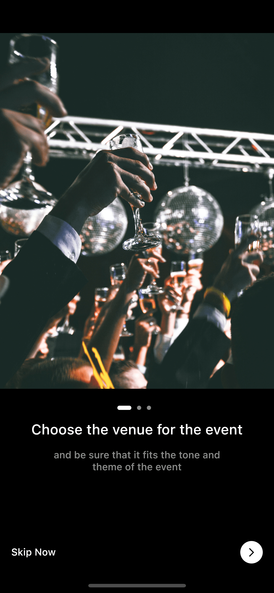

# Trabajo final

## :scroll: Description
Trabajo final para curso Básico / Intermedio de Flutter.

## Some animations

 Viewpager | AnimatedBottomNavigation  
--- | --- | 
 |  

## Screenshots ✨
<!-- You can add more screenshots here if you like -->
&emsp;&emsp;&emsp;&emsp;

## Inspiration

- [Festivals & Events App](https://dribbble.com/shots/14923778-Festivals-Events-App) - Dribbble 
- [Events app](https://dribbble.com/shots/14414394-Events-app) - Dribbble 
- [2Event - Mobile App Design for Events Booking](https://dribbble.com/shots/16396613-2Event-Mobile-App-Design-for-Events-Booking) - Dribbble